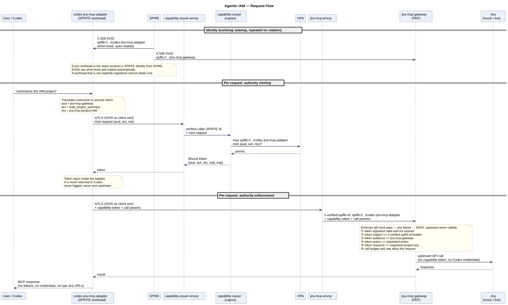
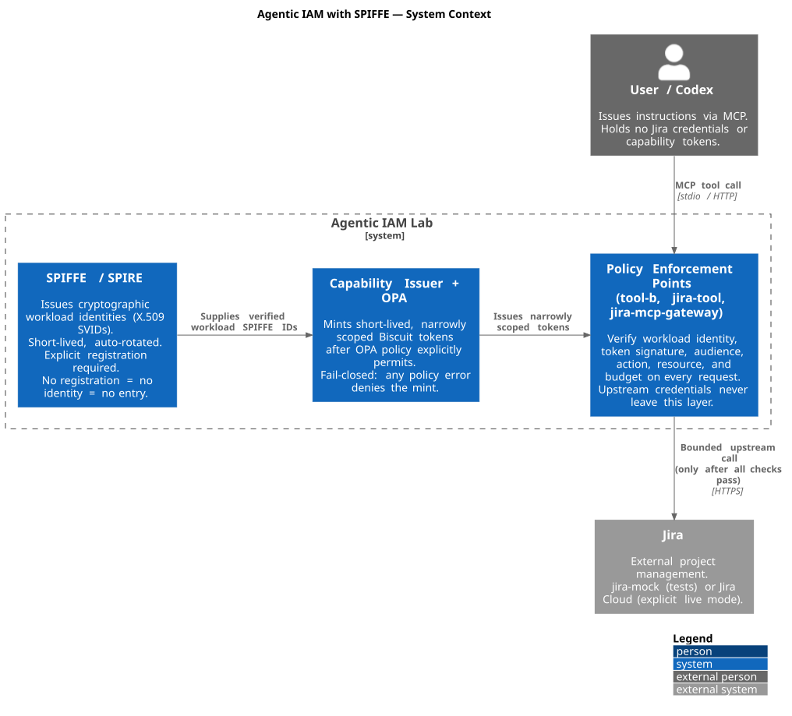
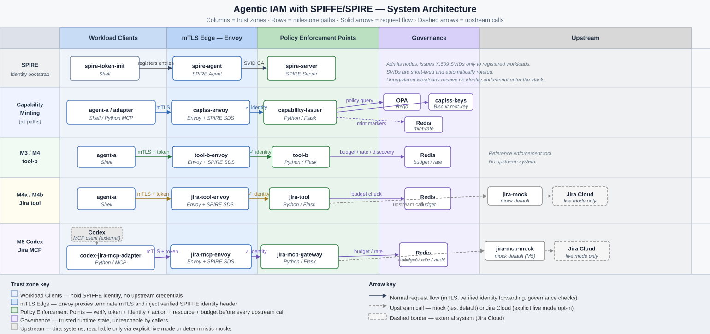

# Agentic IAM with SPIFFE

A reproducible lab that proves least-privilege authority in agentic, tool-using
systems. The core claim: **workload identity is not permission**. Knowing *who*
is calling is not the same as knowing *what they are allowed to do right now*.

The lab wires together SPIFFE/SPIRE, Envoy, a capability-token issuer, OPA
policy, and protected tool services into a stack where every request must
satisfy two independent checks before it reaches an upstream system: the
caller's cryptographic identity, and an explicitly minted, narrowly scoped
authority token.

The current concrete demo is Jira access via MCP: Codex can read bounded
project context and create stories, but never receives Jira API credentials,
capability tokens, or direct Jira URLs.

---

## The Two Layers

Most systems conflate identity with permission. This lab keeps them separate
and enforces each independently.

**Layer 1 — Identity (SPIFFE/SPIRE)**

Every container in the stack is a registered workload. At startup, SPIRE
issues each workload an X.509 SVID — a short-lived, automatically rotated
certificate whose URI SAN is a `spiffe://` identifier such as
`spiffe://example.org/codex-jira-mcp-adapter`. Every service-to-service call
uses mutual TLS: both sides present their SVID and verify the other's. A
workload that is not explicitly registered cannot obtain an SVID and cannot
authenticate into the stack.

Identity proves *who is calling*. It does not open any doors by itself.

**Layer 2 — Authority (capiss + OPA + token enforcement)**

Before a workload can act on a protected resource, it must obtain a capability
token from `capiss` (the capability issuer). `capiss` evaluates an OPA policy
to decide whether this specific identity is allowed to mint authority for a
specific `{audience, action, resource}` tuple. If policy allows it, `capiss`
mints a short-lived, cryptographically signed Biscuit token scoped exactly to
that tuple. The token carries no ambient power — it is valid only for the
declared audience, action, resource, and expiry.

The protected tool re-verifies the token at request time. Holding a token is
not enough; the token's declared subject must match the Envoy-verified caller
identity on the live connection.

---

## How a Request Flows

The diagram below traces a single Jira request end-to-end. The same pattern
applies to every tool in the stack.



Identity and authority are verified by different components at different times.
Compromising one does not compromise the other.

---

## Architecture

**System context** — what the lab is and what it connects to:



**Component overview** — all services, their trust zones, and how requests move through the stack across all milestone paths:



The authoritative component inventory, network segmentation detail, and architecture state are in [docs/architecture.md](docs/architecture.md).

---

## Milestones

Each milestone adds one control and proves it with tests and evidence artifacts.

| Milestone | What was proved |
|---|---|
| M1 | SPIRE trust domain established; rogue node admission denied without a valid join token |
| M2 | Workloads receive SVIDs; all protected service calls use mTLS |
| M2.5 | Envoy edge/app boundary; trusted identity headers cannot be spoofed from outside |
| M3 | Capability token issuance under OPA policy; `tool-b` enforces tokens at request time |
| M4 | Delegation chains, depth limits, Redis-backed budget and rate enforcement |
| M4a | `jira-tool` holds broad Jira access; OPA narrows `agent-a` to `IAM` issue reads only |
| M4b | Narrow description writes added; all other Jira mutations remain out of scope |
| **M5** | Codex reaches Jira via MCP; `codex-jira-mcp-adapter` and `jira-mcp-gateway` implement the full two-layer check for `read_project_summary` and `create_story` on the `IAM` project |

---

## Running the Lab

All commands run from the repo root.

**Preflight**

```bash
docker compose version
scripts/clean_stack.sh --check
```

**Start the stack**

```bash
docker compose -f compose/spiffe.compose.yml up -d --build
```

**Run the full deterministic E2E suite**

```bash
docker compose --profile tests -f compose/spiffe.compose.yml up --build \
  --abort-on-container-exit rogue-tests
```

**Run only the M5 Codex Jira MCP suite**

```bash
docker compose --profile tests -f compose/spiffe.compose.yml run --rm \
  -e TEST_MILESTONES=m5 rogue-tests
```

**Run specific test IDs**

```bash
docker compose --profile tests -f compose/spiffe.compose.yml run --rm \
  -e TEST_ONLY=M5.S1-T1,M5.S1-T2 rogue-tests
```

**Start the local Codex MCP session (stack must already be running)**

```bash
scripts/codex_jira_mcp.sh
```

The launcher bridges stdio into the running `codex-jira-mcp-adapter` container.
It does not start, rebuild, or tear down the Docker stack.

**Varambu audit demo flow**

The Varambu audit demo slice is authored under
`docs/slices/m5-varambu-audit-demo/`. Its target operator story is:

```bash
varambu start --mock
varambu audit
varambu audit-file
```

This flow is not accepted as implemented until the slice completes the
tests-first workflow and records final verification.

**Run the M4a/M4b Jira demo**

```bash
docker compose --profile clients -f compose/spiffe.compose.yml run --rm \
  --no-deps agent-a /app/jira_demo.sh
```

**Live Jira smoke (explicit opt-in, requires credentials in `.env`)**

```bash
JIRA_UPSTREAM_MODE=live docker compose --env-file .env \
  -f compose/spiffe.compose.yml up -d --no-deps --force-recreate jira-tool
make jira-live-smoke
```

**Tear down**

```bash
docker compose --profile tests -f compose/spiffe.compose.yml down --remove-orphans
docker compose -f compose/spiffe.compose.yml down --remove-orphans
```

---

## Tests and Validation

The project treats authored requirements, architecture, trace mappings, and
runtime evidence artifacts as its primary proof model — not test pass/fail
counts alone. Each E2E test captures Premise, Exercise, and Outcome artifacts
so security claims can be inspected after a run.

**Unit tests**

```bash
make unit-trust           # run unit tests
make unit-guard-check     # run unit tests with coverage and mutation gate
```

**Traceability and quality**

```bash
make qa-trace             # validate REQ → ARCH → DD → UT → E2E linkage
make qa-evidence          # check that passing E2E tests produced PEO artifacts
make qa-quality           # ruff, mypy, radon (CC ≤ 10), bandit
```

Evidence artifacts land in `artifacts/rogue-tests/` after a run. The test
report is written to `test_report.log`.

Reference documents:
- Requirements: [docs/requirements.md](docs/requirements.md)
- Architecture: [docs/architecture.md](docs/architecture.md)
- E2E trace map: [trace/tests.yaml](trace/tests.yaml)
- Test specification: [docs/test_spec.md](docs/test_spec.md)
- Detailed E2E behavior: [docs/test_spec_detailed.md](docs/test_spec_detailed.md)
- Unit test specification: [docs/unit_test_spec.md](docs/unit_test_spec.md)

---

## Development Workflow

Security-relevant changes follow a four-phase slice workflow to keep
requirements, architecture, and code in step.

1. **Phase 1 — Plan.** Create a bundle under `docs/slices/<slice-id>/`. Use
   the `grill-me` skill to resolve design choices. Capture decisions, hidden
   state, scope, and non-goals in `plan.md` and `test_plan.md`.
2. **Phase 2 — Tests.** Write UT and E2E tests from the approved `test_plan.md`
   only. If a test requires a new assumption, stop and update the slice docs
   first.
3. **Phase 3 — Implementation.** Implement only approved behavior. Remove dead
   code and stale compatibility paths called out in `plan.md`.
4. **Phase 4 — Verification.** Run trace, quality, E2E, and evidence checks.
   Record the result in `docs/local_status_capture/implementation_status.md`.

See [AGENTS.md](AGENTS.md) for the full operating model and command reference.
Slice templates are in [docs/slices/](docs/slices/).

---

## Future Milestones

- **M6 — Delegation hardening:** authority flows across multiple tools; proof
  that derived tokens only narrow, never amplify.
- **M7 — Governance lifecycle:** policy lifecycle controls, auditability, and
  issuance safety switches.
- **M8 — Intent to limits:** translate natural language intent into a
  mechanical authority envelope.
- **M9 — Intent-constrained issuance:** minted authority is bounded by limits
  derived from intent, not just from static policy.

---

## Non-Goals

- Host or node compromise defense.
- Production hardening: HA, KMS/HSM, full observability.
- Cross-trust-domain federation or multi-tenant guarantees.
- Long-lived token revocation beyond short TTL and issuance controls.
- Trusting an agent's stated intent as authority.

Intent is treated as untrusted input. The lab proves that requests can be
converted into explicit, verifiable, time-bounded limits and that those limits
hold under adversarial conditions.
