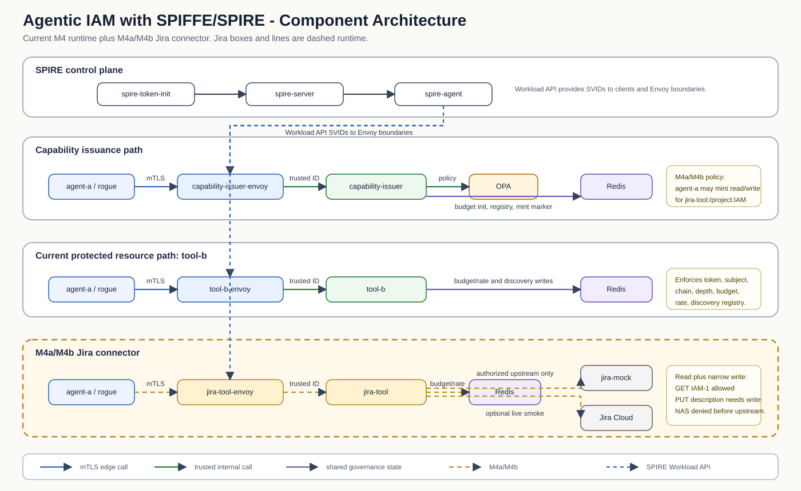
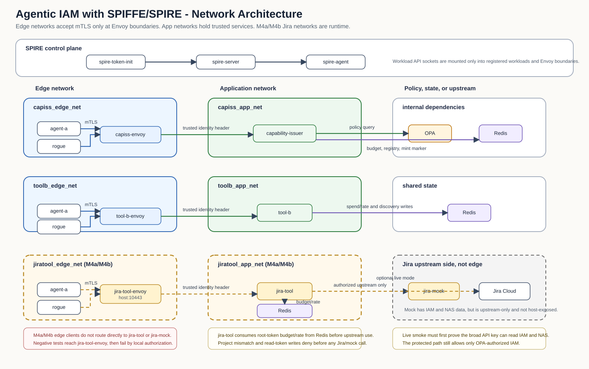

# Agentic IAM with SPIFFE — Current Architecture

This document describes the current implemented architecture in this repository.
It is the authoritative architecture source for traceability.

Scope notes:
- This document describes the current implementation only.
- It does not describe target-state or future architecture.
- Exception: sections explicitly marked as `Approved target` describe pre-implementation slice architecture that has been reviewed before code, and must not be read as current runtime behavior until implemented and validated.
- `Satisfies` lists identify which requirements each section is responsible for satisfying.

## Diagrams

### Component Architecture

This diagram shows the main runtime components and their trust-oriented relationships, including the M4a/M4b Jira tool path and the M5 Codex Jira MCP path.

### Network Architecture

This diagram shows the current network segmentation and boundary layout used by the stack, including the M4a/M4b Jira networks and the M5 Codex Jira MCP networks.
Redis is shown in multiple internal networks as the same shared state service attached where needed.

## ARCH-001 Trust Bootstrap and Node Admission

Type: Logical
Satisfies: REQ-G-R2, REQ-G-R3, REQ-M1-R1, REQ-M1-R2, REQ-M1-R3, REQ-M1-R4, REQ-M1-R5, REQ-M1-R6, REQ-M1-R7, REQ-M1-R8, REQ-M1-R9, REQ-M1-R10, REQ-M1-R11, REQ-M1-R12, REQ-M1-R13, REQ-M1-R14, REQ-M1-R16, REQ-X-R1, REQ-X-R7

Overview:
This subsystem establishes the SPIFFE trust domain, controls how nodes join it, and keeps bootstrap authorization explicit rather than implicit. Its job is to make node admission a governed act instead of a side effect of reachability or startup order.

Trust/Responsibility:
It owns node attestation, join-token based bootstrap, and the server-side state that proves which nodes are actually admitted. It is the primary security locus for preventing rogue node admission, replayed bootstrap material, and duplicate or drifting admission paths.

Interactions:
It connects SPIRE server, SPIRE agent, and bootstrap token initialization. It also underpins the negative attestation tests that validate forged, missing, or replayed bootstrap material.

## ARCH-002 Workload Identity Issuance and Secret Isolation

Type: Logical
Satisfies: REQ-G-R1, REQ-G-R2, REQ-G-R3, REQ-M2-R1, REQ-M2-R2, REQ-M2-R3, REQ-M2-R4, REQ-M2-R5, REQ-M2-R6

Overview:
This subsystem governs workload identity issuance after the trust domain is established. It separates authorization to receive an SVID from simple access to files, sockets, or container runtime surfaces.

Trust/Responsibility:
Its responsibility is to ensure that only explicitly registered workloads receive identities and that identity material for one workload is not exposed to another. It also preserves the distinction between Workload API access, file access, and actual identity issuance.

Interactions:
It is implemented through SPIRE workload registration, the shared agent runtime, and the mounted Workload API paths used by workloads such as tool-b, capability-issuer-envoy, and agent-a.

## ARCH-003 Boundary-Authenticated Transport and Identity Propagation

Type: Logical
Satisfies: REQ-M2-R7, REQ-M2-R8, REQ-M2-R9, REQ-M2-R10, REQ-M2-R11, REQ-M2-R12, REQ-M2-R13, REQ-M2-R14, REQ-M2-R15, REQ-M2-R16, REQ-M2-R17, REQ-M2-R18, REQ-M2-R19, REQ-M2-R20, REQ-M2-R21, REQ-M25-R1, REQ-M25-R2, REQ-M25-R3, REQ-M25-R4, REQ-M25-R5, REQ-M3-R8, REQ-M3-R9, REQ-M4-E4, REQ-M4-E5, REQ-X-R2

Overview:
This subsystem establishes the trusted edge/app boundary pattern. It terminates mTLS at Envoy, derives verified caller identity from the authenticated connection, and forwards requests inward only under the isolated boundary model.

Trust/Responsibility:
Its responsibility is to prevent direct application reachability from untrusted networks and to make trusted identity headers meaningful only inside the protected boundary. This is where transport authentication becomes a trustworthy authorization input.

Interactions:
It connects edge clients to `tool-b-envoy` and `capability-issuer-envoy`, then forwards verified requests into the internal application networks. It also includes the special no-OPA envoy path used to validate fail-closed mint behavior.

## ARCH-004 Capability Issuance and Policy Decision

Type: Logical
Satisfies: REQ-G-R1, REQ-G-R2, REQ-G-R3, REQ-M3-R3, REQ-M3-R4, REQ-M3-R5, REQ-M3-R6, REQ-M3-R7, REQ-M3-R10, REQ-M3-R11, REQ-M3-R12, REQ-M3-R13, REQ-M3-R14, REQ-M3-R15, REQ-M3-R25, REQ-M4-D1, REQ-M4-D2, REQ-M4-D3, REQ-M4-D4, REQ-M4-B7, REQ-M4-P1, REQ-M4-E3, REQ-M4-O2, REQ-X-R6

Overview:
This subsystem mints explicit authority artifacts after policy evaluation. It keeps identity and authority separate, treats requested authority as untrusted input, and turns allowed authority into signed capability tokens with enforceable fields.

Trust/Responsibility:
Its responsibility is to gate minting on policy, enforce required authority fields at issuance time, and ensure root or delegated tokens are minted centrally rather than inferred by clients. It is also where new-resource minting is checked against discovery-derived proof in the current M4 slice. For M4 canonical-resource enforcement, mint-time authority is expected to use canonical `tool-b:/...` resources only.

Interactions:
It connects the capability issuer, the policy decision point, and the ingress boundary that supplies verified caller identity. It also interacts with shared state when root budget initialization, formula-based new-resource mint-rate enforcement, and registry-gated resource minting are needed.

## ARCH-005 Request-Time Capability Enforcement

Type: Logical
Satisfies: REQ-G-R1, REQ-G-R2, REQ-G-R3, REQ-M3-R1, REQ-M3-R2, REQ-M3-R16, REQ-M3-R17, REQ-M3-R18, REQ-M3-R19, REQ-M3-R20, REQ-M3-R21, REQ-M3-R22, REQ-M3-R23, REQ-M3-R24, REQ-M3-R26, REQ-M3-R27, REQ-M4-CH1, REQ-M4-DL1, REQ-M4-DL2, REQ-M4-DL3, REQ-M4-E1, REQ-M4-E2, REQ-M4-E4, REQ-M4-O1, REQ-M4-O3, REQ-M4-O4, REQ-X-R6

Overview:
This subsystem is the request-time enforcement path. It verifies tokens at the moment of use and denies access unless the caller identity, token authenticity, token claims, and current enforcement context all line up.

Trust/Responsibility:
Its responsibility is to make capability use a real authorization check rather than a token-presence check. It enforces authenticity, expiry, subject binding, audience, action, resource, and the current M4 chain and depth rules. For M4 canonical-resource enforcement, request-time checks are expected to evaluate against the same canonical `tool-b:/...` resource form used at mint-time.

Interactions:
It connects the Envoy boundary for verified caller identity, the tool implementation that performs request-time checks, and the shared state consulted during M4 governance enforcement.

## ARCH-006 Shared Governance State and Discovery Registry

Type: Logical
Satisfies: REQ-G-R2, REQ-G-R3, REQ-M4-B1, REQ-M4-B2, REQ-M4-B3, REQ-M4-B4, REQ-M4-B5, REQ-M4-B6, REQ-M4-B7, REQ-M4-P1, REQ-M4-P2, REQ-M4-P3, REQ-M4-P4, REQ-M4-E1, REQ-M4-E3, REQ-M4-O1, REQ-M4-O3, REQ-M4-O4

Overview:
This subsystem provides the trusted shared state used by the current M4 implementation. It holds the budget and rate state keyed by `root_token_id`, the mint-rate state used to bound new-resource mint fan-out, and the discovery registry used to gate minting of new resource-scoped capabilities.

Trust/Responsibility:
Its responsibility is to keep governance truth out of untrusted agents and inside trusted services plus shared state. It is central to fail-closed request spending, discovery-time expansion, and later audit or drift analysis.

Interactions:
It is used by capability issuance for root-budget initialization, mint-rate consumption, and registry membership checks, and by tool-b for per-request spend/rate consumption and discovery writes.

Authoritative State:
The current M4 slice depends on four Redis-backed authoritative state families. `m4:registry:<root_token_id>` is written by tool-b during discovery and read by capability-issuer to decide whether a new resource-scoped mint is allowed; capability-issuer no longer seeds this set during root mint. `m4:budget:<root_token_id>` and the related request-rate keys are initialized or consumed by trusted services and are used only for request-time governance enforcement. `m4:mint_rate:<root_token_id>` is written and consumed by capability-issuer to enforce the formula-based new-resource mint allowance per root-token context. `m4:capiss_minted:<token_id>` is written by capability-issuer when it mints a delegated or resource-scoped token and is later read by capability-issuer and tool-b as issuer-provenance state for the current resource-transition delegation rule.

## ARCH-007 Evidence and Security Verification Harness

Type: Logical
Satisfies: REQ-G-R4, REQ-G-R5, REQ-M1-R15, REQ-X-R3, REQ-X-R4, REQ-X-R5, REQ-T-R1, REQ-T-R2, REQ-T-R3, REQ-T-R4, REQ-T-R5, REQ-T-R6, REQ-T-R7, REQ-T-R8

Overview:
This subsystem defines how the project proves security behavior. It is responsible for collecting authoritative evidence, distinguishing control failures from harness failures, and structuring tests around premise, exercise, and outcome.

Trust/Responsibility:
Its responsibility is not to enforce system security directly, but to ensure that security claims are backed by meaningful proof. It prevents false-green outcomes by requiring guard evidence and by preferring authoritative sources such as server state, logs, and direct enforcement results.

Interactions:
It connects the rogue test harness, evidence artifact capture, profiling output, and the generated test specifications that document what the harness actually executes.

## ARCH-008 SPIRE Server

Type: Component
Satisfies: REQ-M1-R1, REQ-M1-R2, REQ-M1-R3, REQ-M1-R4, REQ-M1-R5, REQ-M1-R6, REQ-M1-R7, REQ-M1-R8, REQ-M1-R9, REQ-M1-R14, REQ-M1-R16

Overview:
SPIRE server is the authoritative control-plane service for node and workload registration state. It is the system of record for node admission and the trust anchor used by the rest of the SPIFFE domain.

Trust/Responsibility:
It is the primary authority for attestation acceptance and server-side admission state. When a requirement depends on proving whether a node was admitted, this component is the authoritative evidence source.

Interactions:
It accepts node attestation from agents, stores registration state, and is queried by the harness during M1 verification.

## ARCH-009 SPIRE Token Init

Type: Component
Satisfies: REQ-M1-R6, REQ-M1-R13

Overview:
The token-init component prepares bootstrap material for the local lab topology. It is a bootstrap helper that makes admission material available to the intended node path.

Trust/Responsibility:
Its responsibility is limited to explicit bootstrap setup. It matters because new valid bootstrap paths must exist only through operator-controlled changes.

Interactions:
It writes join-token material into the shared bootstrap location consumed by the legitimate SPIRE agent flow.

## ARCH-010 SPIRE Agent

Type: Component
Satisfies: REQ-M1-R4, REQ-M2-R1, REQ-M2-R2, REQ-M2-R3, REQ-M2-R6

Overview:
SPIRE agent mediates workload attestation and exposes the Workload API used by workloads to fetch X.509 SVIDs. It is the local identity issuer surface seen by the workloads in this lab.

Trust/Responsibility:
It is responsible for enforcing the separation between socket presence and actual identity issuance. A mounted socket is not itself authorization to receive an SVID without matching workload registration.

Interactions:
It connects local workloads to the SPIRE server and provides the Workload API socket mounted into the appropriate containers.

## ARCH-011 capability-issuer-envoy

Type: Component
Satisfies: REQ-M2-R19, REQ-M2-R20, REQ-M2-R21, REQ-M25-R1, REQ-M25-R2, REQ-M25-R3, REQ-M25-R4, REQ-M25-R5, REQ-M3-R8, REQ-M3-R9

Overview:
This Envoy instance is the trusted ingress boundary for the capability issuer. It terminates mTLS, derives verified caller identity, and forwards requests inward on the isolated app network.

Trust/Responsibility:
Its responsibility is to ensure that issuer identity input is boundary-derived rather than caller-supplied. That makes the issuer’s policy decisions dependent on authenticated identity instead of spoofable request metadata.

Interactions:
It accepts external mint requests, forwards them to the capability issuer service, and carries the verified identity model into the issuer path.

## ARCH-012 capability-issuer

Type: Component
Satisfies: REQ-M3-R3, REQ-M3-R4, REQ-M3-R5, REQ-M3-R6, REQ-M3-R7, REQ-M3-R10, REQ-M3-R11, REQ-M3-R12, REQ-M3-R13, REQ-M3-R14, REQ-M3-R15, REQ-M3-R25, REQ-M4-D1, REQ-M4-D2, REQ-M4-D3, REQ-M4-D4, REQ-M4-B7, REQ-M4-P1, REQ-M4-E3, REQ-M4-O2

Overview:
The capability issuer is the central authority that mints root and resource-scoped capability tokens. It translates allowed policy outcomes into explicit signed authority artifacts and enforces the current M4 new-resource mint-rate rule.

Trust/Responsibility:
It owns mint-time validation, required token fields, delegated token metadata, current M4 registry-gated resource minting, and current M4 new-resource mint-rate enforcement. It is also the current source for mint-decision logging and must emit one final mint-decision event for every mint exit path. In the canonical-resource cleanup slice it is responsible for rejecting non-canonical mint requests instead of silently preserving compatibility aliases.

Interactions:
It receives verified identity from Envoy, queries OPA for mint policy, reads and writes shared state where needed, enforces the new-resource mint-rate against Redis-backed state, emits structured JSON mint-decision events to stdout for container-log capture, and returns signed tokens to callers.

## ARCH-013 OPA

Type: Component
Satisfies: REQ-M3-R3, REQ-M3-R4, REQ-M3-R5, REQ-M3-R6, REQ-M3-R7

Overview:
OPA provides the current policy decision point for capability minting. It turns requested authority plus verified caller identity into an explicit allow or deny result.

Trust/Responsibility:
Its responsibility is to provide policy-gated decisions and to fail closed when policy is unavailable or invalid. It prevents minting from degrading into a local allow shortcut. For M4 canonical-resource enforcement, policy inputs are expected to use canonical `tool-b:/...` resource strings only.

Interactions:
It is called by the capability issuer over the internal app network and is deliberately isolated from edge callers.

## ARCH-014 tool-b-envoy

Type: Component
Satisfies: REQ-M2-R7, REQ-M2-R8, REQ-M2-R9, REQ-M2-R12, REQ-M2-R19, REQ-M2-R20, REQ-M2-R21, REQ-M25-R1, REQ-M25-R2, REQ-M25-R3, REQ-M25-R4, REQ-M25-R5, REQ-M4-E4, REQ-M4-E5

Overview:
This Envoy instance is the trusted ingress boundary for tool-b. It terminates mTLS, forwards verified caller identity inward, and keeps the application off the untrusted edge network.

Trust/Responsibility:
Its responsibility is to preserve the trusted-header model by ensuring headers are injected only by the isolated boundary. It also enforces the boundary pattern that protects tool-b from direct edge access.

Interactions:
It accepts edge requests from clients, forwards them to tool-b on the internal app network, and participates in the request-time identity contract enforced by tool-b.

## ARCH-015 tool-b

Type: Component
Satisfies: REQ-M2-R12, REQ-M2-R14, REQ-M2-R15, REQ-M2-R16, REQ-M2-R17, REQ-M2-R18, REQ-M3-R1, REQ-M3-R2, REQ-M3-R16, REQ-M3-R17, REQ-M3-R18, REQ-M3-R19, REQ-M3-R20, REQ-M3-R21, REQ-M3-R22, REQ-M3-R23, REQ-M3-R24, REQ-M3-R26, REQ-M3-R27, REQ-M4-CH1, REQ-M4-DL1, REQ-M4-DL2, REQ-M4-B2, REQ-M4-B3, REQ-M4-B4, REQ-M4-B5, REQ-M4-P2, REQ-M4-P3, REQ-M4-P4, REQ-M4-E1, REQ-M4-E3, REQ-M4-E4, REQ-M4-O1, REQ-M4-O3, REQ-M4-O4

Overview:
tool-b is the current protected resource server and the main request-time enforcement point. It applies endpoint authorization, verifies capability tokens, and performs the current M4 governance checks during protected requests.

Trust/Responsibility:
It is responsible for enforcing that identity alone is not enough, that tokens are valid for the caller and requested action, and that the M4 chain, budget, and discovery behaviors are checked during actual use. In the canonical-resource cleanup slice it is responsible for mapping request paths to canonical `tool-b:/...` resource identifiers before authorization.

Interactions:
It receives verified caller identity from tool-b-envoy, consults Redis during M4 enforcement, and writes discovery records for the current registry-based flow.

## ARCH-016 Redis

Type: Component
Satisfies: REQ-M4-B2, REQ-M4-B3, REQ-M4-B4, REQ-M4-B5, REQ-M4-B6, REQ-M4-B7, REQ-M4-P2, REQ-M4-P3, REQ-M4-P4, REQ-M4-O3, REQ-M4-O4

Overview:
Redis is the trusted shared state used by the current M4 slice. It stores request budget and rate information, the new-resource mint-rate state used by capability-issuer, and the discovery registry that binds new resources to a root token context.

Trust/Responsibility:
Its responsibility is to provide shared authoritative state for governance checks that cannot be delegated to agents. It is also the failure point that drives fail-closed behavior when trusted state becomes unavailable.

Interactions:
It is accessed by capability-issuer and tool-b over the internal networks for budget initialization, mint-rate consumption, request consumption, and registry lookups or writes.

Authoritative State:
This component currently stores:
- `m4:registry:<root_token_id>`:
  - writer: tool-b
  - readers: capability-issuer
  - purpose: discovery-backed proof that a newly requested resource was previously discovered under the same root token context
  - note: root mint no longer seeds this set with the root token's starting resource
- `m4:budget:<root_token_id>` and associated request-rate keys:
  - writer/reader: tool-b, with root-budget initialization from capability-issuer
  - purpose: per-root-token governance truth for request spending and rate limiting
- `m4:mint_rate:<root_token_id>`:
  - writer/reader: capability-issuer
  - purpose: per-root-token consumed count for the new-resource mint-rate rule `max(1, floor(root_token_lifetime_seconds / 20))`
  - note: the key TTL is bounded to the remaining root-token lifetime
- `m4:capiss_minted:<token_id>`:
  - writer: capability-issuer
  - readers: capability-issuer, tool-b
  - purpose: issuer-provenance marker for delegated or resource-scoped child tokens in the current M4 implementation

## ARCH-020 Shared Enforcement Contract

Type: Component
Satisfies: REQ-M4-D1, REQ-M4-D3, REQ-M4-D4, REQ-M4-CH1, REQ-M4-DL1, REQ-M4-DL2, REQ-M4-E2

Overview:
This component is the in-process shared enforcement module imported by both capability-issuer and tool-b. It is not a network service. It centralizes the current M4 token-chain contract so both services evaluate the same chain structure, derived depth, and attenuation semantics.

Trust/Responsibility:
Its responsibility is to eliminate semantic drift between mint-time and request-time chain validation. It owns required chain metadata checks, parent-link continuity, derived depth calculation, and the shared non-amplification rules used by both services.

Interactions:
It is loaded directly into the capability-issuer and tool-b Python processes at startup. Service-local policy evaluation, Redis lookups, identity binding, signature verification, and HTTP response handling remain outside this component.

Authoritative State Boundary:
This component does not own shared mutable state itself. It consumes token-chain contents directly and accepts service-local callbacks when a chain decision depends on authoritative state outside the token. In the current M4 slice, the main external-state dependency is the Redis-backed `m4:capiss_minted:<token_id>` issuer-provenance marker used to allow the `/search` to `tool-b:/read-file:*` resource transition only when the child token was minted through the trusted capability-issuer path.

## ARCH-017 capability-issuer-no-opa-envoy

Type: Component
Satisfies: REQ-M3-R6, REQ-M3-R7

Overview:
This test-only Envoy path forwards to a capability issuer configured with an unavailable OPA endpoint. It exists solely to prove that minting fails closed when policy evaluation cannot complete.

Trust/Responsibility:
Its responsibility is evidentiary rather than production-serving. It provides a deterministic boundary path for proving fail-closed mint behavior.

Interactions:
It is used only by the rogue test harness during fail-closed capability issuance scenarios.

## ARCH-018 agent-a

Type: Component
Satisfies: REQ-M2-R10, REQ-M2-R11

Overview:
agent-a is the current intended client workload used to exercise legitimate calls through both the capability issuer and tool-b. It represents the expected in-domain caller for positive-path flows.

Trust/Responsibility:
Its responsibility in the architecture is to act as a real client that verifies server identity through the configured trust bundle and expected target identity rather than bypassing transport verification.

Interactions:
It connects to capability-issuer-envoy and tool-b-envoy over mTLS using workload identity fetched from SPIRE agent.

## ARCH-019 rogue-tests Harness

Type: Component
Satisfies: REQ-G-R4, REQ-G-R5, REQ-M1-R15, REQ-X-R3, REQ-X-R4, REQ-X-R5, REQ-T-R1, REQ-T-R2, REQ-T-R3, REQ-T-R4, REQ-T-R5, REQ-T-R6, REQ-T-R7, REQ-T-R8

Overview:
The rogue-tests harness is the executable security verification layer for the integration and end-to-end suite. It drives adversarial scenarios, captures guard evidence, and writes the report and artifact set used for false-green analysis.

Trust/Responsibility:
It is responsible for proving that the intended negative or positive path was actually exercised and for preserving the evidence needed to distinguish real enforcement outcomes from harness errors.

Interactions:
It orchestrates Docker-based scenarios, records evidence under `artifacts/rogue-tests`, and writes the summarized run output into `test_report.log`.

## ARCH-021 M4a/M4b Jira Authority Issuance and Policy

Type: Logical
Satisfies: REQ-M4A-J1, REQ-M4A-J3, REQ-M4A-J4, REQ-M4B-W1, REQ-M4B-W2

Status:
Implemented in M4a; extended in M4b.

Overview:
This subsystem extends the existing capability issuance model to Jira project authority. It keeps Jira access and description-write authority as explicit authority minted by `capiss` under OPA policy rather than as a side effect of a broad upstream Jira API credential.

Trust/Responsibility:
OPA is the source of truth for allowed Jira projects and actions. For M4a, `spiffe://example.org/agent-a` may mint `aud=jira-tool`, `act=read`, `res=jira-tool:/project:IAM`. For M4b, the same workload may also mint `aud=jira-tool`, `act=write`, `res=jira-tool:/project:IAM`. Other Jira project/action mint requests deny by default. `capiss` remains responsible for required authority fields, canonical Jira resource validation, policy evaluation, root token issuance, root budget initialization, and mint-decision audit events.

Interactions:
The agent calls `capability-issuer-envoy` over mTLS. The Envoy boundary injects verified caller identity into `capiss`. `capiss` sends the requested Jira authority tuple to OPA, and on allow returns a signed root capability token that `jira-tool` can verify locally.

## ARCH-025 M4b Jira Write Action Semantics

Type: Logical
Satisfies: REQ-M4B-W2, REQ-M4B-W3

Status:
Implemented in M4b.

Overview:
M4b adds one new Jira action, `act=write`, while keeping the same project-scoped resource model from M4a. The action is intentionally not a general Jira write grant.

Trust/Responsibility:
OPA and `capiss` are responsible for minting only the allowed `IAM` write tuple. `jira-tool` is responsible for interpreting `act=write` as permission to read issues and replace descriptions in the matching project. `act=read` remains read-only and cannot satisfy a write request.

Interactions:
`GET /jira/rest/api/3/issue/<ISSUE_KEY>` accepts either `act=read` or `act=write` after subject, audience, expiry, project, budget, and rate checks pass. `PUT /jira/rest/api/3/issue/<ISSUE_KEY>` accepts only `act=write` after the same checks pass.

## ARCH-022 jira-tool-envoy

Type: Component
Satisfies: REQ-M4A-J11

Status:
Implemented in M4a.

Overview:
`jira-tool-envoy` is the trusted ingress boundary for the Jira facade. It mirrors the existing boundary pattern used for `tool-b-envoy`: terminate mTLS, derive verified caller identity, inject the trusted identity header, and forward traffic inward to `jira-tool`.

Trust/Responsibility:
Its responsibility is transport authentication, server identity presentation to clients, verified caller identity propagation, and network-boundary preservation. It is not the semantic Jira authorization decision point; `capiss` and `jira-tool` own authority issuance and use-time enforcement.

Interactions:
`jira-tool-envoy` is attached to `jiratool_edge_net` and `jiratool_app_net`. `agent-a` and `rogue` are attached to `jiratool_edge_net` so positive and negative proofs exercise the boundary. `jira-tool` is not attached to the edge network. The host exposure is `10443` for the Jira facade only.

## ARCH-023 jira-tool

Type: Component
Satisfies: REQ-M4A-J1, REQ-M4A-J2, REQ-M4A-J5, REQ-M4A-J6, REQ-M4A-J7, REQ-M4A-J8, REQ-M4A-J9, REQ-M4A-J10, REQ-M4A-J12, REQ-M4B-W1, REQ-M4B-W3, REQ-M4B-W4, REQ-M4B-W5, REQ-M4B-W6, REQ-M4B-W7, REQ-M4B-W8

Status:
Implemented in M4a; extended in M4b.

Overview:
`jira-tool` is the protected Jira resource server and request-time PEP for M4a/M4b. It holds the upstream Jira API credential in live mode, but it must not treat that credential as caller authority.

Trust/Responsibility:
`jira-tool` verifies capiss-signed root Jira project tokens, binds token subject to the Envoy-injected SPIFFE identity, enforces `aud=jira-tool`, action semantics, and project resource scope, consumes shared M4 request budget/rate state, and only then calls Jira or `jira-mock`. It supports issue reads for M4a and the M4b description-only update route.

Interactions:
For `GET /jira/rest/api/3/issue/<ISSUE_KEY>`, `jira-tool` derives the requested project from the issue key prefix, compares it with the token project, and denies project mismatch before upstream use. For successful upstream issue responses, it verifies `fields.project.key` matches the authorized project before returning the body unchanged. For `PUT /jira/rest/api/3/issue/<ISSUE_KEY>`, it requires `act=write`, accepts only a single plain-text `description` field, converts that text to Jira REST v3 Atlassian Document Format under `fields.description`, and returns `204 No Content` on successful upstream update. It constructs upstream Jira Basic auth internally in live mode, uses no real Jira credential in mock mode, strips client-supplied authorization or impersonation headers before upstream calls, and emits `jiratool_enforcement_decision` audit events.

Network and State:
`jira-tool` is attached to `jiratool_app_net`, not `jiratool_edge_net`. It reaches Redis over `jiratool_app_net` for `m4:budget:<root_token_id>` and request-rate checks. It reaches `jira-mock` only as upstream test infrastructure, or Jira Cloud only in explicit live mode.

## ARCH-026 Jira Description Update Adapter

Type: Logical
Satisfies: REQ-M4B-W4, REQ-M4B-W5, REQ-M4B-W6, REQ-M4B-W8, REQ-M4B-W9

Status:
Implemented in M4b.

Overview:
The description update adapter is the narrow write surface inside `jira-tool`. It deliberately is not a transparent Jira proxy and does not accept arbitrary `fields`, comments, transitions, attachments, search, delete, or raw Jira REST payloads.

Trust/Responsibility:
`jira-tool` owns local request validation, action/project authorization, ADF conversion, upstream dispatch, and audit logging. The agent supplies only plain text; it never receives the upstream Jira credential or controls the upstream authorization headers.

Interactions:
The agent sends `PUT /jira/rest/api/3/issue/<ISSUE_KEY>` with `{"description":"..."}`. `jira-tool` authorizes the request before reading the request as upstream authority, converts the description to Jira Cloud ADF, calls `/rest/api/3/issue/<ISSUE_KEY>` with method `PUT`, and returns `204` on success. `jira-mock` stores the resulting description document and request log for deterministic black-box evidence.

Authoritative State:
| State | Store/System | Writer | Reader | TTL/Lifecycle | Decision Impact | Classification |
| --- | --- | --- | --- | --- | --- | --- |
| Jira allowed project/action tuple | OPA policy/data | Operator/repo config | OPA during capiss mint decision | Deployment lifecycle | Determines whether `agent-a` may mint `act=write` for `jira-tool:/project:IAM` | Authoritative |
| `m4:budget:<root_token_id>` | Redis | capiss initializes; `jira-tool` consumes | `jira-tool` | Bounded by root token expiry | Denies Jira reads/writes when budget is missing, invalid, exhausted, or store unavailable | Authoritative |
| M4 request-rate key | Redis | `jira-tool` | `jira-tool` | Rate window/root TTL bounded | Denies Jira reads/writes on rate limit or store error | Authoritative |
| Jira issue description | Jira Cloud or `jira-mock` | `jira-tool` after local authorization | Jira Cloud, `jira-mock`, protected GET path | Upstream lifecycle | Holds the live or mock description update left by M4b smoke/demo | Upstream state |
| Jira mock request log | `jira-mock` memory | `jira-mock` | test harness | Test lifecycle | Evidence that project/body denials did not call upstream and allowed writes did call upstream | Test evidence |

## ARCH-024 jira-mock and Live Jira Smoke Proof

Type: Logical
Satisfies: REQ-M4A-J13, REQ-M4B-W9

Status:
Implemented in M4a; extended in M4b.

Overview:
The Jira proof model must show that the upstream can access more Jira data than the agent is authorized to use through `capiss` and `jira-tool`. The local deterministic proof uses `jira-mock`; optional live smoke uses Jira Cloud with a broad API credential.

Trust/Responsibility:
`jira-mock` is broad upstream test infrastructure, not an enforcement component. It contains data for allowed project `IAM` and non-allowed project `NAS`, can return both when reached directly by test/internal access, stores description updates accepted by `jira-tool`, and logs GET/PUT requests. Optional live smoke must first prove the live Jira API credential can directly read both an `IAM-*` issue and a `NAS-*` issue before evaluating the protected path, then performs the protected M4b description update through `jira-tool`.

Interactions:
`jira-mock` is reachable by `jira-tool` and by the test harness for precondition and request-log evidence. It is not attached to the Jira edge network and is not host-exposed. Its request-log/reset endpoints are test-only and must not be reachable by agents.

## ARCH-027 M5 Codex Jira MCP Session Boundary

Type: Component
Satisfies: REQ-M5-CJ1, REQ-M5-CJ2, REQ-M5-CJ4

Status:
Implemented in M5 Slice 1.

Overview:
The M5 Codex boundary consists of a local launcher and the `codex-jira-mcp-adapter` workload. Codex is treated as untrusted input. It starts a stdio MCP session through the launcher, which executes into the already-running adapter container. The adapter exposes exactly `read_project_summary` and `create_story`.

Trust/Responsibility:
The launcher owns only local process bridging and must not mutate stack lifecycle. The adapter owns MCP translation, fixed tool-to-action mapping, fresh token minting per call, correlation propagation, and internal gateway forwarding. It is not a PDP or PEP and must not authorize project allowlists locally.

Interactions:
The adapter calls `capability-issuer-envoy` over SPIFFE mTLS for `aud=jira-mcp-gateway` tokens and calls `jira-mcp-envoy` over SPIFFE mTLS for protected Jira MCP requests. It has no inbound Envoy in Slice 1 because Codex reaches it through local stdio.

## ARCH-028 M5 Jira MCP Authority Issuance

Type: Logical
Satisfies: REQ-M5-CJ3, REQ-M5-CJ4, REQ-M5-CJ10

Status:
Implemented in M5 Slice 1.

Overview:
M5 adds a distinct Jira MCP authority family to `capiss`: `aud=jira-mcp-gateway`, `act=read_project_summary|create_story`, and `res=jira-mcp:/project:<KEY>`. This authority is separate from the M4a/M4b `jira-tool` audience and resource family.

Trust/Responsibility:
OPA is the source of truth for allowed M5 project/action tuples. `capiss` validates strict M5 project resource syntax, evaluates policy, initializes shared root budget, signs the token, and emits mint-decision events. Only `spiffe://example.org/codex-jira-mcp-adapter` may mint M5 Slice 1 authority for `IAM`; `NAS`, future actions, old subjects, and mixed M4/M5 authority forms deny.

Interactions:
The adapter presents its SPIFFE identity to `capability-issuer-envoy`; Envoy injects the verified identity into `capiss`; `capiss` returns a short-lived root token used only inside the adapter-to-gateway request path.

## ARCH-029 jira-mcp-envoy

Type: Component
Satisfies: REQ-M5-CJ5, REQ-M5-CJ10

Status:
Implemented in M5 Slice 1.

Overview:
`jira-mcp-envoy` is the M5 gateway ingress boundary. It terminates mTLS, verifies allowed client workload identities, injects the trusted `x-spiffe-id` header, and forwards to `jira-mcp-gateway`.

Trust/Responsibility:
The Envoy boundary is responsible for transport authentication and trusted caller identity propagation. It is not the semantic authorization decision point. The gateway still verifies the capiss token and binds token subject to the Envoy-verified caller identity.

Interactions:
`codex-jira-mcp-adapter` reaches `jira-mcp-envoy` on the M5 edge network. The gateway app is not attached to that edge network. The test harness may use the edge path for black-box proof.

## ARCH-030 jira-mcp-gateway

Type: Component
Satisfies: REQ-M5-CJ2, REQ-M5-CJ5, REQ-M5-CJ6, REQ-M5-CJ7, REQ-M5-CJ8, REQ-M5-CJ9, REQ-M5-CJ10

Status:
Implemented in M5 Slice 1.

Overview:
`jira-mcp-gateway` is the M5 protected Jira request-time PEP. It is an internal HTTP service behind `jira-mcp-envoy`, not an MCP-native gateway in Slice 1.

Trust/Responsibility:
The gateway verifies capiss-signed tokens, token expiry, token subject, audience, endpoint-bound action, resource syntax, payload project, and Envoy caller identity before upstream use. It validates the bounded summary and story-create contracts, verifies optional same-project epics, strips client-supplied upstream authorization/impersonation headers, consumes Redis budget/rate governance immediately before upstream use, and emits `jiramcp_gateway_decision` audit events.

Interactions:
`POST /mcp/jira/project-summary` requires `act=read_project_summary`. `POST /mcp/jira/stories` requires `act=create_story`. The gateway calls `jira-mcp-mock` in deterministic mode or Jira Cloud only in explicit live mode. It uses Redis for the existing M4 `m4:budget:<root_token_id>` and request-rate keys.

## ARCH-031 jira-mcp-mock and M5 Live Smoke Proof

Type: Logical
Satisfies: REQ-M5-CJ6, REQ-M5-CJ7, REQ-M5-CJ8, REQ-M5-CJ10

Status:
Implemented in M5 Slice 1.

Overview:
`jira-mcp-mock` is the deterministic upstream Jira Cloud substitute for M5. It is separate from the M4a/M4b `jira-mock` and includes broad `IAM` and `NAS` fixtures to prove protected-path narrowing.

Trust/Responsibility:
The mock is not an authorization component. It returns broad upstream project data, stores created stories, verifies fixture availability for epic checks, records request logs, supports reset and failure injection endpoints for tests, and captures enough request metadata to prove that only the gateway performs upstream operations.

Interactions:
`jira-mcp-gateway` calls the mock over the private Jira MCP app network. The mock is also attached to the test-only upstream inspection network so the harness can access mock premise and evidence endpoints without exposing the gateway app listener. Codex, the launcher, the adapter, capiss, and Envoys do not receive live Jira credentials.

Authoritative State:
| State | Store/System | Writer | Reader | TTL/Lifecycle | Decision Impact | Classification |
| --- | --- | --- | --- | --- | --- | --- |
| M5 allowed authority tuple | OPA policy/data | Operator/repo config | OPA during capiss mint | Deployment lifecycle | Determines whether adapter may mint `read_project_summary` or `create_story` for `IAM` | Authoritative |
| M5 capiss token | Adapter process memory | capiss | Adapter, gateway | Root token TTL; one fresh token per MCP call | Grants one narrow M5 action/resource for gateway use | Authoritative secret |
| Envoy verified M5 caller | `jira-mcp-envoy` trusted header | Envoy | gateway | Request lifecycle | Must match token subject before upstream use | Authoritative |
| M5 request budget/rate | Redis `m4:*` keys | capiss initializes; gateway consumes | gateway | Bounded by root expiry/rate window | Denies summary/create when exhausted, missing, invalid, rate-limited, or store unavailable | Authoritative |
| Jira API credential | gateway live environment only | Operator/live setup | gateway | Live runtime secret lifecycle | Enables live upstream calls only after local enforcement | Sensitive secret |
| MCP session process | Adapter container process | launcher | Codex stdio | One MCP server session | Transports untrusted MCP requests and bounded responses | Runtime transport |
| M5 correlation ID | Adapter, capiss, gateway, mock/live logs | adapter or gateway | tests/operators | Request lifecycle | Reconstructs mint, enforcement, upstream, and Codex-visible result | Evidence metadata |
| jira-mcp-mock request log | mock memory | mock | test harness | Test lifecycle/reset per test | Proves upstream calls happened only after authorization and only from gateway path | Test evidence |
